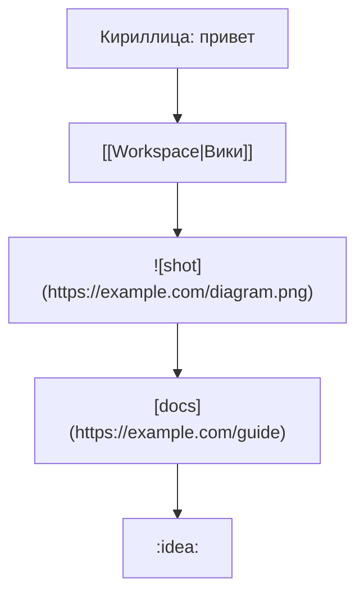
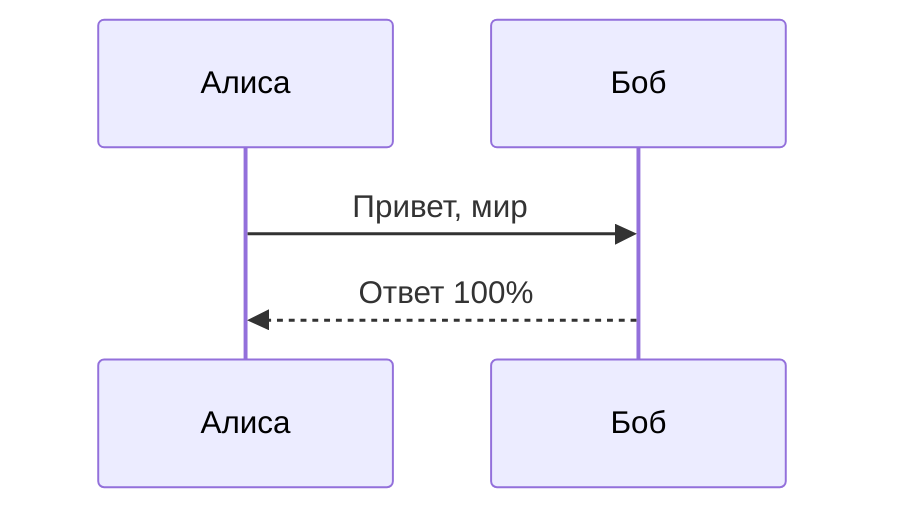
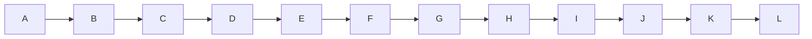

Neighbor paragraph before the diagrams.


```mermaid
flowchart TD
  Start["Кириллица: привет"] --> Next["[[Workspace|Вики]]"]
  Next --> Img["![shot](https://example.com/diagram.png)"]
  Img --> Link["[docs](https://example.com/guide)"]
  Link --> Icon[":idea:"]
```


```mermaid
sequenceDiagram
  participant Алиса
  participant Боб
  Алиса->>Боб: Привет, мир
  Боб-->>Алиса: Ответ 100%
```


```mermaid
flowchart LR
  A --> B --> C --> D --> E --> F --> G --> H --> I --> J --> K --> L
```

```text
print("not a diagram")
```

```mermaid
flowchart TD
  A -->
```

Outside link [[Workspace]] and a shortcode :idea:.


